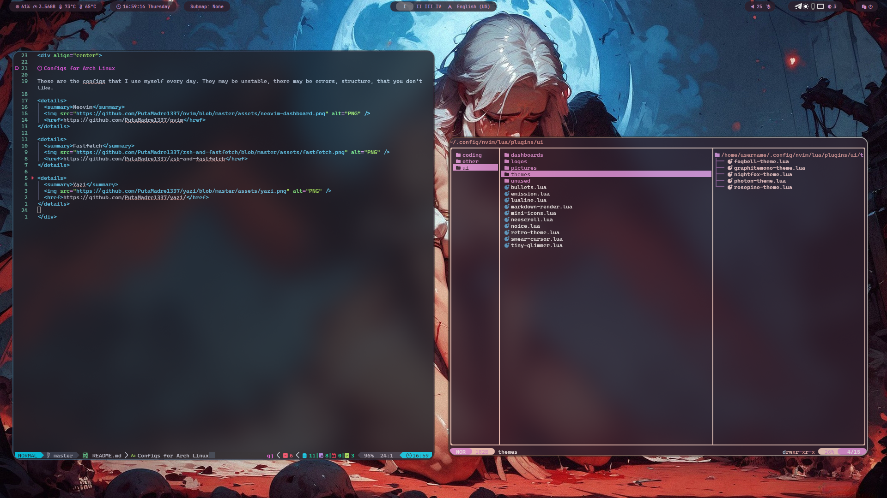

<div align="center">
  ## My fork of this [repository](https://github.com/prasanthrangan/hyprdots).

  
</div>


# Hyprland configuration for Arch linux
For keymaps see [this directory.](keybinds)

## Also
[Waybar](https://github.com/PutaMadre1337/waybar)
[Rofi](https://github.com/prasanthrangan/hyprdots/tree/main/Configs/.config/rofi)
[Wlogout](https://github.com/prasanthrangan/hyprdots/tree/main/Configs/.config/wlogout) (replace "swaylock" with "hyprlock")
[Dunst](https://github.com/prasanthrangan/hyprdots/tree/main/Configs/.config/dunst)

## Dependencies (install from AUR)
### Main
```
pipewire                        
pipewire-alsa                   
pipewire-audio                  
pipewire-jack                   
pipewire-pulse                  
gst-plugin-pipewire             
wireplumber                     
pavucontrol                     
pamixer                         
networkmanager                  
network-manager-applet          
brightnessctl                   
udiskie                         
sddm                            
qt5-quickcontrols               
qt5-quickcontrols2              
qt5-graphicaleffects            
hyprland                        
dunst                           
rofi-wayland                    
waybar                          
swww                            
hyprlock
wlogout                         
grimblast-git                   
hyprpicker                      
slurp                           
swappy                          
cliphist                        
polkit-gnome                    
xdg-desktop-portal-hyprland     
parallel                        
jq                              
imagemagick                     
qt5-imageformats                
ffmpegthumbs                    
kde-cli-tools                   
libnotify                       
nwg-look                        
qt5ct                           
qt6ct                           
kvantum                         
kvantum-qt5                     
qt5-wayland                     
qt6-wayland                     
hyde-cli-git                                          
```

### Optional
```
zen-browser
kitty                           
eza                             
oh-my-zsh-git                   
zsh-theme-powerlevel10k-git
starship
fastfetch                       
pyprland-git
```
